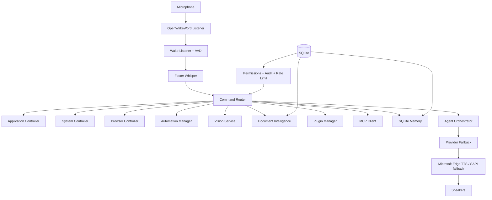

# JARVIS AI Operating System

A production-grade, modular Python 3.11+ AI voice assistant for Windows. The project runs in the background, wakes offline with OpenWakeWord, and provides an extensible AI operating system with persistent memory, multi-provider fallback, agents, plugins, MCP, RAG, vision, security controls, and an optional desktop status UI.

## What Changed In This Upgrade

- Added SQLite persistence for conversation history, semantic memory, task history, documents, plugins, preferences, and audit logs.
- Added provider fallback across OpenAI, Gemini, Claude, OpenRouter, Groq, Ollama, and LM Studio.
- Added streaming response plumbing and interruptible Microsoft Edge TTS playback.
- Added adaptive VAD, lightweight noise suppression, wake-word matching, voice profiles, and optional voice authentication.
- Added specialist agents: planner, reasoning, coding, research, vision, automation, memory, and security.
- Added plugin loading with manifests, permissions, and hot reload.
- Added MCP stdio client support for external Model Context Protocol servers.
- Added RAG/document intelligence for PDF, DOCX, TXT, CSV, Excel, PowerPoint, Markdown, HTML, JSON, and source code.
- Added optional vision support for screenshots, webcam frames, OCR, QR/barcode reading, face detection, and basic object/color region detection.
- Added safer system automation with permission gates, audit logs, rate limiting, and filesystem read/write roots.
- Added notes, to-dos, task history, clipboard history, Windows Search, registry reads, and environment variable commands.
- Added a lightweight Tkinter GUI for status, transcript, mic state, and performance monitoring.
- Added unit tests for config, memory, RAG, and command routing.

## Folder Structure

```text
assistant/
  __init__.py
  main.py
  config.py
  logger.py
  database.py
  security.py
  audio_processing.py
  wake_word.py
  wake_listener.py
  speech_to_text.py
  text_to_speech.py
  llm.py
  agents.py
  memory.py
  command_router.py
  system_controller.py
  browser_controller.py
  application_controller.py
  automation.py
  plugin_system.py
  mcp_client.py
  rag.py
  vision.py
  gui.py
  utils.py
tests/
  test_config.py
  test_memory.py
  test_rag.py
  test_command_router.py
requirements.txt
README.md
.env.example
```

## Architecture



## Installation

```powershell
python -m venv .venv
.\.venv\Scripts\Activate.ps1
python -m pip install --upgrade pip
pip install -r requirements.txt
python -c "from openwakeword import utils; utils.download_models(['hey_jarvis'])"
Copy-Item .env.example .env
```

Edit `.env`, add your provider keys, and choose `AI_PROVIDER`:

```env
AI_PROVIDER=openai
OPENAI_API_KEY=...
VOICE_NAME=en-US-AriaNeural
```

Run:

```powershell
python -m assistant.main
```

The first Faster Whisper run downloads the selected Whisper model. For GPU transcription, install the CUDA runtime that matches your machine and set:

```env
WHISPER_DEVICE=cuda
WHISPER_COMPUTE_TYPE=float16
```

## Core Behavior

1. The assistant runs in the background.
2. It waits for `Hey Jarvis`.
3. It plays a startup chime.
4. It says: `Hello Hari, I'm listening.`
5. It records utterances using VAD.
6. Faster Whisper transcribes speech to text.
7. The router handles local commands first.
8. Natural prompts go to the agent orchestrator and selected LLM provider.
9. Microsoft Edge TTS speaks the response.
10. `stop listening`, `sleep`, `goodbye`, `exit`, or `cancel` returns to wake-word mode.

## LLM Providers

Switch providers without code changes:

```env
AI_PROVIDER=openai
AI_PROVIDER=gemini
AI_PROVIDER=claude
AI_PROVIDER=openrouter
AI_PROVIDER=groq
AI_PROVIDER=ollama
AI_PROVIDER=lmstudio
```

Fallback order is configured with:

```env
AI_PROVIDER_FALLBACK_ORDER=openai,gemini,claude,openrouter,groq,ollama,lmstudio
```

The assistant tries `AI_PROVIDER` first, then walks `AI_PROVIDER_FALLBACK_ORDER` until a provider returns a non-empty response. Providers without required API keys are skipped at startup, while local providers such as Ollama and LM Studio are tried when their local servers are reachable.

Ollama and LM Studio work through local servers. OpenRouter and Groq use OpenAI-compatible chat-completions clients. The shared `HTTP_TIMEOUT_SECONDS` setting is used for local HTTP calls and OpenAI-compatible clients.

## Agent Modes

Voice commands:

```text
switch to reasoning mode
switch to coding mode
switch to research mode
switch to planning mode
```

The orchestrator selects specialized agents automatically for code, planning, research, vision, automation, memory, and security requests.

## Memory

Memory is stored in SQLite and supports:

```text
remember that I prefer concise Python examples
search memory for Python examples
forget memory Python examples
backup memory
```

Memory includes short-term conversation context, long-term semantic memory, conversation summaries, preferences, and task history.

## RAG And Document Intelligence

Index files:

```text
index document C:\Users\Hariharan\Documents\paper.pdf
search documents for transformer architecture
chat with documents about deployment risks
```

Supported formats include PDF, DOCX, TXT, CSV, Excel, PowerPoint, Markdown, HTML, JSON, and source code. Local hashed embeddings are used by default, so document search works without an embedding API.

## Vision

Voice commands:

```text
analyze screen
read screen
analyze webcam
analyze image C:\path\to\image.png
ocr image C:\path\to\image.png
```

Vision features are optional and depend on installed system tools. OCR uses `pytesseract`, so install the Tesseract application if you want OCR text extraction.

## Plugins

Plugins live in `PLUGINS_DIR`, with one folder per plugin:

```text
plugins/my_plugin/
  plugin.json
  plugin.py
```

Example manifest:

```json
{
  "id": "hello",
  "name": "Hello Plugin",
  "version": "1.0.0",
  "description": "Example command plugin",
  "permissions": [],
  "commands": [
    {"phrase": "say hello", "function": "handle"}
  ]
}
```

Example `plugin.py`:

```python
def handle(text: str) -> str:
    return "Hello from the plugin."
```

Enable or disable plugins with:

```env
ENABLE_PLUGINS=true
ENABLE_PLUGIN_HOT_RELOAD=true
```

## MCP

Enable MCP:

```env
ENABLE_MCP=true
MCP_CONFIG_FILE=~/.jarvis_assistant/mcp_servers.json
```

Example MCP config:

```json
{
  "servers": [
    {
      "name": "filesystem",
      "command": ["python", "-m", "my_mcp_server"],
      "env": {}
    }
  ]
}
```

Voice commands:

```text
list mcp tools from filesystem
call mcp filesystem tool read_file with {"path":"README.md"}
```

## Safety And Security

Risky operations are gated:

```env
ENABLE_POWER_COMMANDS=false
ENABLE_DESTRUCTIVE_SYSTEM_COMMANDS=false
ENABLE_FILE_DELETE=true
ALLOWED_READ_ROOTS=~
ALLOWED_WRITE_ROOTS=~
RATE_LIMIT_MAX_EVENTS=30
RATE_LIMIT_WINDOW_SECONDS=60
```

Audit events are stored in SQLite. API keys can be migrated to the local encrypted vault through the `SecretVault` class. Set `JARVIS_MASTER_KEY` for deterministic vault encryption.

## Voice And Audio Tuning

```env
WAKE_WORD_ENABLED=true
WAKE_WORD=hey jarvis
WAKEWORD_THRESHOLD=0.5
WAKE_WORDS=jarvis,hey jarvis
ENABLE_WAKE_WORD=true
ENABLE_NOISE_SUPPRESSION=true
NOISE_GATE_MULTIPLIER=1.8
VOICE_NAME=en-US-AriaNeural
ENABLE_STREAMING_TTS=true
TTS_INTERRUPT_ENABLED=true
ENABLE_VOICE_AUTH=false
VOICE_AUTH_THRESHOLD=0.92
SPEECH_SILENCE_SECONDS=1.05
```

List microphone devices:

```powershell
python -c "import sounddevice as sd; print(sd.query_devices())"
```

Set `INPUT_DEVICE` to a device index or name.

## GUI

Enable the optional desktop control center:

```env
ENABLE_GUI=true
GUI_THEME=dark
```

The GUI shows status, live transcript events, microphone state, and CPU/RAM usage.

## Tests

Run fast unit tests:

```powershell
pytest
```

Run syntax verification:

```powershell
python -m compileall assistant tests
```

## Running In The Background

```powershell
Start-Process -WindowStyle Hidden -FilePath ".\.venv\Scripts\python.exe" -ArgumentList "-m assistant.main"
```

For startup on login, create a Windows Task Scheduler task that runs:

```text
C:\path\to\project\.venv\Scripts\python.exe -m assistant.main
```

with the project directory as the working directory.

## Notes

This project is Windows-first because many requested commands target Windows applications, registry, Task Scheduler, volume, brightness, and desktop controls. Optional features degrade gracefully when their external tools are unavailable.


